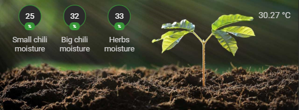

# Mi Flora Picture Elements Card



The color of the badges will depend on your [theme](https://www.home-assistant.io/lovelace/views/#themes).




```yaml
        - type: picture-elements
          image: /local/plants.jpg
          elements:
            - type: state-badge
              entity: sensor.small_chili_moisture
              style:
                top: 27%
                left: 10%
                --ha-label-badge-font-size: 1em
            - type: state-badge
              entity: sensor.big_chili_moisture
              style:
                top: 27%
                left: 25%
                --ha-label-badge-font-size: 1em
            - type: state-badge
              entity: sensor.herbs_moisture
              style:
                top: 27%
                left: 40%
                --ha-label-badge-font-size: 1em
            - type: state-label
              entity: sensor.greenhouse_temperature
              style:
                top: 15%
                left: 92%
                --ha-label-badge-font-size: 1em
```

 

Here is the config for a combined temperature sensor


This requires you to have the following component setup

* [Mi Flora](https://www.home-assistant.io/components/sensor.miflora/)

or some other kind of plant sensors with moisture and temperature.

Change the entity ids to those of your temperature sensors.


```yaml
sensor:
  - platform: min_max
    name: Greenhouse temperature
    type: mean
    entity_ids:
      - sensor.small_chili_temperature
      - sensor.big_chili_temperature
      - sensor.herbs_temperature
```


